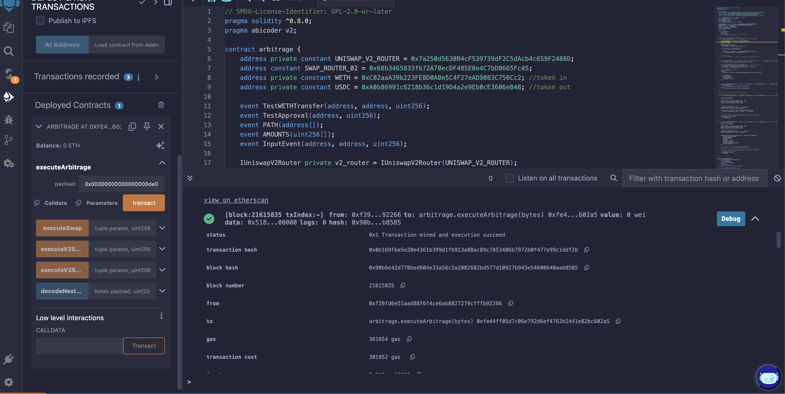
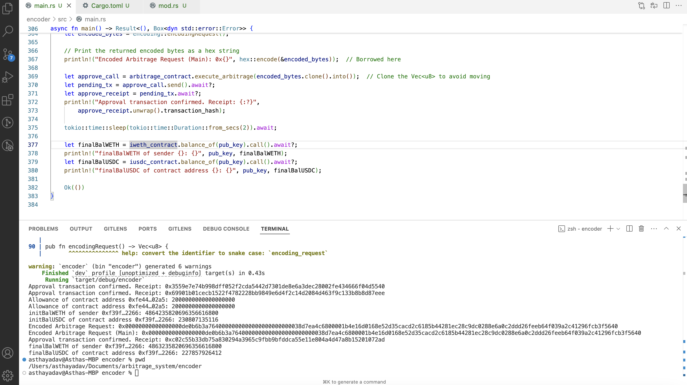
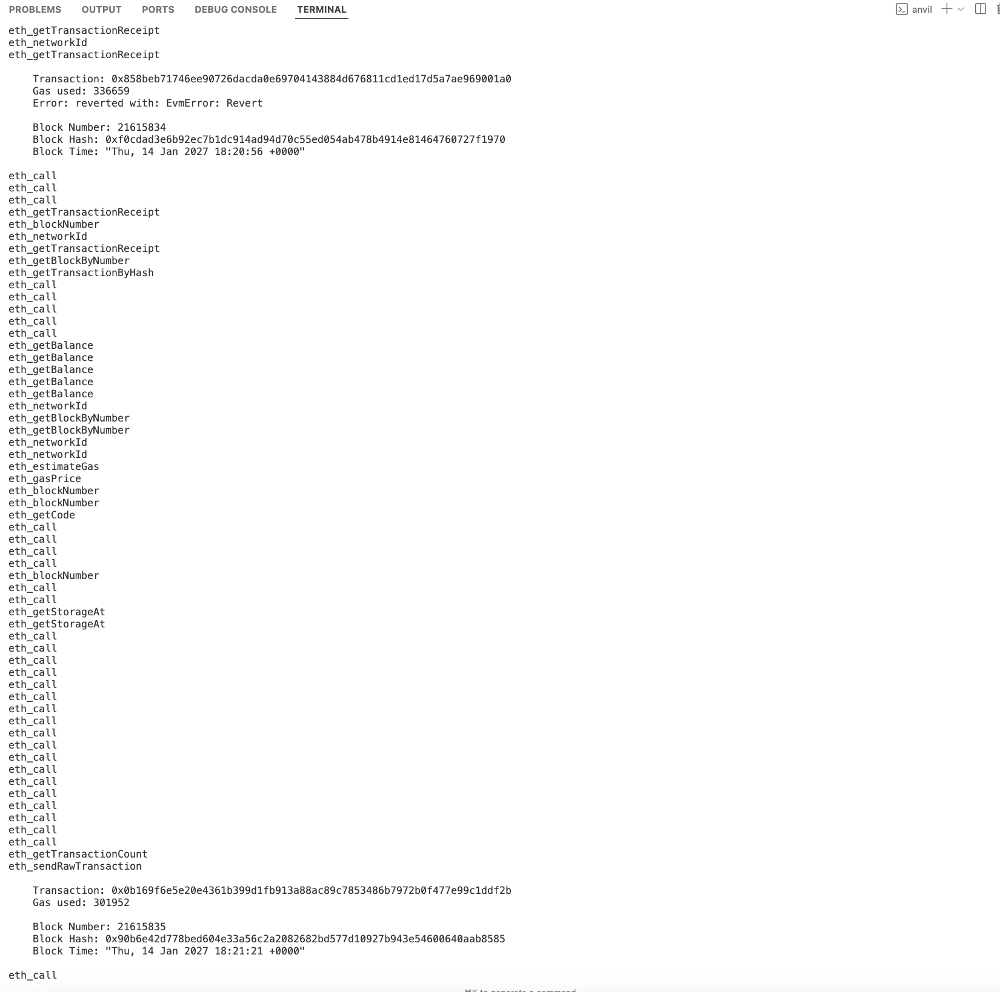

# Arbitrage-Flashswaps

This project facilitates atomic arbitrage across Uniswap V2 and Uniswap V3 pools using flash swaps in a single transaction on Ethereum. It includes a Solidity smart contract for executing the swaps and a Rust-based encoder/decoder for generating the required payload. The implementation ensures efficient and gas-optimized arbitrage, validating profits and minimizing risks.

### Arbitrage Smart Contract

The Solidity smart contract performs atomic arbitrage by dynamically handling multiple hops across Uniswap V2 and Uniswap V3 pools. It leverages flash swaps to execute trades within a single transaction and ensures profitability through validation mechanisms. 

It takes a payload containing swap parameters, decodes the data, and executes sequential swaps. Key highlights of the contract:

1. **Decoding Payload**: The `executeArbitrage` function decodes the provided payload to extract swap parameters like pool type, token direction, and pool address for each hop.
2. **Dynamic Swap Execution**: It supports both Uniswap V2 and V3 swaps based on the pool type and token direction using `executeV2Swap` and `executeV3Swap` methods.
3. **Profit Validation**: After executing all swaps, it checks if the profit exceeds the specified minimum to ensure the arbitrage was successful.
4. **Token Approvals**: Tokens are dynamically approved and transferred to the respective pools during the swaps to facilitate seamless execution.
5. **WETH and USDC Tokens**: The contract assumes WETH as the starting and ending token, while USDC is involved in intermediate swaps.
6. **Gas Optimization**: The implementation minimizes gas usage by leveraging calldata for decoding and conditional swap execution.

### Backend

The backend, implemented in Rust, encodes and decodes arbitrage requests and interacts with the Ethereum smart contract. It provides seamless integration between off-chain logic and on-chain execution.

#### Features:
1. Request Encoding:
- Encodes arbitrage requests into a payload format accepted by the smart contract.
- Payload includes: 
1. 128-bit WETH input amount for the first swap.
2. 128-bit expected minimum profit in WETH.
3. Sequentially packed hop details (1-bit pool type, 1-bit direction, 160-bit pool address).
- Smart Contract Interaction:
1. Uses ethers-rs to send transactions to the Ethereum network.
2. Handles responses and reverts from the smart contract.
- Error Handling: Decodes revert reasons for debugging and troubleshooting.
- Decoding: Converts the smart contract response or payload back into readable hop details and profit data.

#### Ethereum Smart Contract Interaction
main.rs is the simple rust implementation to interact with an Ethereum arbitrage smart contract using ethers-rs.

##### Prerequisites
1. Please run localnode of mainnet fork using
[Local Development - Mainnet Fork](https://docs.uniswap.org/sdk/v3/guides/local-development)

##### Setup
1. Clone repo and go to encoder folder:
   ```bash
   cd encoder
   ```
2. Install dependencies:
   ```bash
   cargo build
   ```
3. Copy `.env_example` to `.env` and add required data
4. Run:
   ```bash
   cargo run
   ```

##### Features
1. Connect to Ethereum node
2. Interact with the arbitrage smart contract
3. Execute swaps between Uniswap V2/V3

#### Encoder
##### Arbitrage Contract Encoding and Decoding

This Rust program defines and encodes an arbitrage request for decentralized exchanges like UniswapV2 and UniswapV3, and decodes the request from its hexadecimal representation.

###### Key Components:
1. **ArbitrageHop**: Represents a hop in the arbitrage path, storing the pool type (UniswapV2/UniswapV3), direction (token0/token1), and pool address.
2. **ArbitrageRequest**: Encodes a full arbitrage request with input amount (WETH), minimum profit, and a list of hops.
3. **Encoding**: Converts the arbitrage request into a byte array and encodes it into a hex string.
4. **Decoding**: Decodes the hex string back into the original arbitrage request and prints out the input amount, minimum profit, and hop details for testing.
5. **Main**: Demonstrates encoding and decoding with a sample arbitrage request.

This encoder ensures efficient serialization and deserialization of arbitrage data for smart contract interactions.

##### Setup and Usage


### Arbitrage Request Example
Example request structure in JSON format:
```json
[
  {
    "pool_type": "uniswap_v2",
    "pool_address": "0xB4e16d0168e52d35CaCD2c6185b44281Ec28C9Dc",
    "amount_in": "1000000000000000000",
    "amount_out": "3500000000",
    "token_in": "0xC02aaA39b223FE8D0A0e5C4F27eAD9083C756Cc2",
    "token_out": "0xA0b86991c6218b36c1d19D4a2e9Eb0cE3606eB48"
  },
  {
    "pool_type": "uniswap_v3",
    "pool_address": "0x88e6A0c2dDD26FEEb64F039a2c41296FcB3f5640",
    "amount_in": "3500000000",
    "amount_out": "1001000000000000000",
    "token_in": "0xA0b86991c6218b36c1d19D4a2e9Eb0cE3606eB48",
    "token_out": "0xC02aaA39b223FE8D0A0e5C4F27eAD9083C756Cc2"
  }
]
```

### Future Considerations
1. Enhanced Token Support:
- Try for other swaps. Due to time limitation and other factors, want to explore more optimised ways of swapping.
- Expand support for additional tokens and DEX protocols.

2. Real-Time Profitability Analysis
Integrate with market analytics tools to identify profitable opportunities dynamically.

3. Additional Optimizations:
- Even though there were many gas optimizations done, would want to explore further gas savings by optimizing calldata structure and on-chain processing.

4. Advanced Risk Mitigation: Implement mechanisms to handle slippage, fees, and market volatility.

### Outputs
1. Smart Contract Execution: Demonstrates successful arbitrage transactions


2. Rust Encoder Execution: Shows encoding and decoding of requests and interaction with the smart contract


3. Mainnet Fork Execution: Illustrates transaction execution in a simulated mainnet fork.

